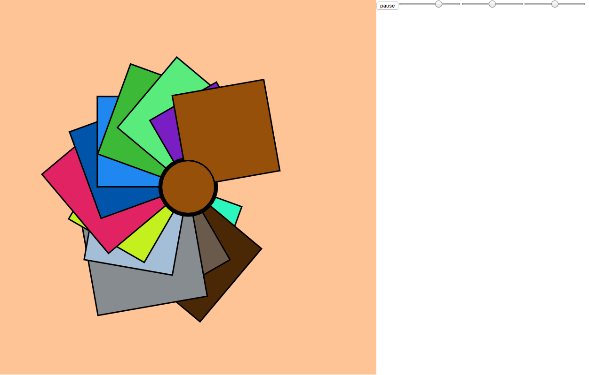

# TuneWheel
> This project was created during Spotify's Music Visualization Hackathon.

	https://yamilburgos.github.io/TuneWheel

## Tech Stack:
- JavaScript
- p5.js
- HTML5
- CSS3

## Team Members
* [Naeohmi](https://github.com/naeohmi/)
* [Yamil](https://github.com/yamilburgos/)

## Contributing
1. Fork it (<https://github.com/naeohmi/tunewheel/fork>)
2. Create your feature branch (`git checkout -b feature/fooBar`)
3. Commit your changes (`git commit -am 'Add some fooBar'`)
4. Push to the branch (`git push origin feature/fooBar`)
5. Create a new Pull Request

<!-- Markdown link & img dfn's -->
[travis-image]: https://img.shields.io/travis/dbader/node-datadog-metrics/master.svg?style=flat-square
[travis-url]: https://travis-ci.org/dbader/node-datadog-metrics